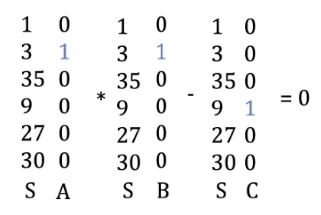
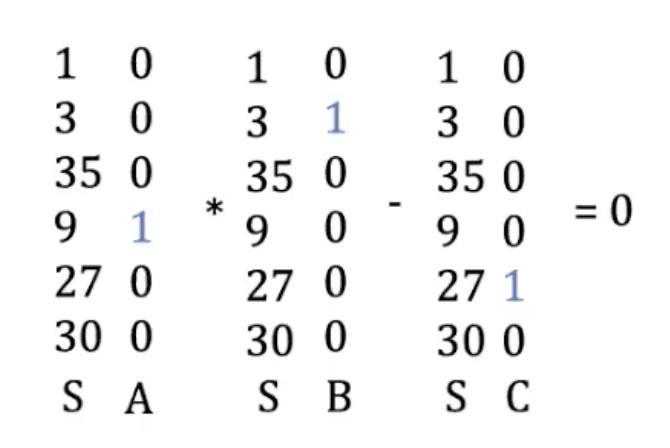
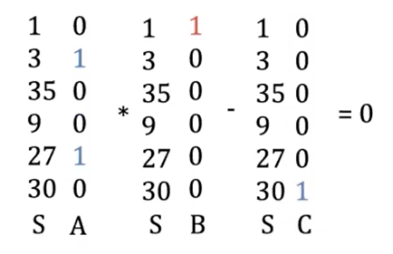
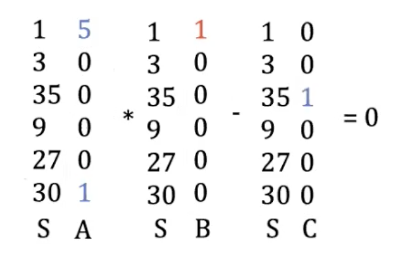
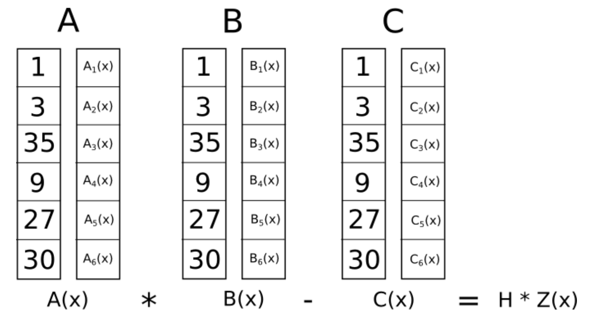

# ZK SNARKS Introduction

## Prerequisite(What is ZK SNARKS)
[Zero-knowledge proofs](http://people.csail.mit.edu/silvio/Selected%20Scientific%20Papers/Proof%20Systems/The_Knowledge_Complexity_Of_Interactive_Proof_Systems.pdf) (**ZKP**) were first introduced by Shafi Goldwasser, Silvio Micali and Charles Rackoff. A zero-knowledge proof allows one party, the prover, to convince another party, the verifier, that a given statement is true, without revealing any information beyond the validity of the statement itself. 

<<<<<<< HEAD
`zkSNARK`(zero-knowledge succinct non-interactive argument of knowledge) is a variant of a zero-knowledge proof that enables a prover to succinctly convince any verifier of the validity of a given statement without revealing any information apart from the statement itself and without interaction between the prover and any verifier. ZKP can be divided into two categories:  
* **Interactive**: In this type of ZKP, interactions between the Prover and the Verifier are required. In one round of interation, the verifier 𝒱 needs to send a challenge to the prover 𝒫 and the prover P will response. The interaction is similar to that of the TCP/IP protocol. Through multiple rounds of interaction, the verifier can verify the correctness of prover's statement.
* **Non-interactive**: Interation between the prover P and the verifier 𝒱 is not required in this type of ZKP. The non-interactive ZKP can usually be obtained from an interactive ZKP by using the [Fiat-Shamir Transform](https://en.wikipedia.org/wiki/Fiat%E2%80%93Shamir_heuristic#cite_note-1) in the Random Oracle model. In practice, the Random Oracle is usually instantiated by a collision-resistant cryptographic hash functions. By this technique, the prover can generate randomness (used for the hidden challenge) on behalf of the verifier. Similar to the process where a user sends an ECDSA signature for consensus node consistency verification, the entire process only involves one data transmission.
=======
`zkSNARK`(zero-knowledge succinct non-interactive argument of knowledge) is a variant of a zero-knowledge proof that enables a prover to succinctly convince any verifier of the validity of a given statement without revealing any information apart from the statement itself and without interaction between the prover and any verifier.
[skalman]: # (Why this in quote? why is it beginning with > sign?)
> ZKP can be divided into two categories:  
>* **Interactive**: In this type of ZKP, interactions between the Prover and the Verifier are required. In one round of interation, the verifier 𝒱 needs to send a challenge to the prover 𝒫 and the prover P will response. The interaction is similar to that of the TCP/IP protocol. Through multiple rounds of interaction, the verifier can verify the correctness of prover's statement.
>* **Non-interactive**: Interation between the prover P and the verifier 𝒱 is not required in this type of ZKP. The non-interactive ZKP can usually be obtained from an interactive ZKP by using the [Fiat-Shamir Transform](https://en.wikipedia.org/wiki/Fiat%E2%80%93Shamir_heuristic#cite_note-1) in the Random Oracle model. In practice, the Random Oracle is usually instantiated by a collision-resistant cryptographic hash functions. By this technique, the prover can generate randomness (used for the hidden challenge) on behalf of the verifier. Similar to the process where a user sends an ECDSA signature for consensus node consistency verification, the entire process only involves one data transmission.
>>>>>>> d97ad9fe728564fc5ebcb0d7328d0f3a37d005bf

zkSNARKs can be used to prove and verify the validity of a general statement. A prover with the knowledge of the witness for a statement can produce a succinct proof non-interactively that attests to the truth of this statement. Anyone can then efficiently verify this short proof, which offers the following properties:

* **Zero-knowledge** - the verifier learns nothing from the proof beside the truth of the statement.
* **Succinctness** - the proof is short（a few hundred bytes） compared to the statement itself and easy to verify.
* **Non-interactivity**: - it does not require back-and-forth interaction between the prover and the verifier.
* **Soundness** - the proof is computationally sound (i.e., it is infeasible to fake a **valid** proof of a false statement). Such a proof system is also called an argument.
* **Proof of knowledge** - the proof attests not just that the statement is true, but also that the prover knows why (e.g., has knowledge of a valid private input, this input is usually referred to as witness in ZkSnark).

Together, these properties comprise a zkSNARK, which stands for a **Z**ero-**K**nowledge **S**uccinct **N**on-interactive **A**rgument of **K**nowledge.

After introducing the above theory, we will use a simple scenario to illustrate how ZKP works: Alice wants to prove to Bob that a `house(public signal)` belongs to her (statement). How can she prove it to Bob without showing him the `key(private input or witness)` of house? Alice just needs to ask Bob to turn around while she opens the door to the house. Then, she asks Bob to turn back and show him that `the door is now open(proof)`. This proves that the house belongs to Alice. In this process, Alice has not revealed any part related to her key, so it is **zero-knowledge**.

A secure ZKP should be based on a NP problem to prevent an adversary from forging a valid proof without access to the secret witness. NP problem is not solvable in polynomial time, but given a solution, it can be verified in polynomial time whether the solution is correct. For example, in the above scenario, someone without the key (`the witness, a solution to this problem`), the problem of opening a door is essentially `an intractable problem in polynomial time`. However, if a key（solution） is given, a prover can easily open the door. Also, once the proof of a solution is discovered (i.e., the door has been opened), a verifier can `confirm the correctness of this solution in polynomial time`. This is the essence of **ZKP**. Later on, we will delve deeper into the core concept of ZkSnark and explore more features beyond general ZKP, such as succinctness and Non-interactivity.


## How to construct ZK SNARKS?
OK, here we will explain one way of constructing ZK SNARKS. In short, these are the basic steps:

- Generate the CRS
- Construct arithmetic circuits
- Convert circuit to R1CS
- Convert R1CS to QAP
- Generate proof
- Verify proof

We will explain each step in details in the following.

## Generate the CRS
In ZKSNARKs, `CRS(Common Reference String)` is a random public parameter generated by a trusted third party (which can be replaced by a multi-party committee ([MPC](https://en.wikipedia.org/wiki/Secure_multi-party_computation)) which includes at least one honest member). CRS can be used to generate proofs and verify the correctness of zero-knowledge proofs. ZKSNARKs rely on CRS as a public parameter for proving & verifying. This CRS must be generated in advance by a trusted party. The information used to create the CRS, called ‘toxic waste’ needs to be destroyed as soon as the CRS is created. Otherwise, it can be used by adversaries to forge fraudulent proofs.

An example of generating CRS using MPC is [Powers of Tau](https://eprint.iacr.org/2017/1050) ceremony, which can help ensure that the generated CRS is safe and reliable. The [ceremony](https://github.com/ZcashFoundation/powersoftau-attestations/) was proposed by the core developers of Zcash in 2017 to address security risks that may exist in the CRS generation process, especially the risk of a man-in-the-middle attack.

The specific process of the "Powers of Tau" ceremony is that participants need to generate random numbers in a specific way according to a specific protocol and contribute them to the CRS generation process. After the participants submit their contributions, the contributions are combined together and verified using cryptographic methods to ensure that the generated CRS is correct and no one can control the generation process through malicious means.

Due to the widely recognized security of the "Powers of Tau" ceremony, it has become a standard process for generating CRS in many zkSNARKs systems, such as the Bowe-Hopwood-Tessaro (BHT) construction for zk-SNARKs and the zk-SNARKs implementation for the [Zcash cryptocurrency](https://z.cash/), among others.

## Construct arithmetic circuits
The arithmetic circuit is another key component in ZKSNARK.

ZKSNARKs permits proving statement（a computational problem）, but they cannot be applied to the computational problem directly, the statement first needs to be converted into the right form. i.e., an arithmetic circuit which only consists of addition and multiplication gates. The circuit is a Directed Acyclic Graph on which at each node of the graph an arithmetic operation is performed. Although it may not always be obvious how to do this conversion, most computational problems we care about can easily be converted into arithmetic circuits.

So, the need for arithmetic circuits arises in ZKSNARK proofs because it is required to prove that a statement (such as the answer to a specific question) satisfies certain conditions without revealing any private information other than the statement itself. The arithmetic circuit provides a method transforming a general computational problem into a formal arithmetic circuit, and then the prover needs to prove that he has a valid solution（witness） to this arithmetic circuit without leaking any information of this solution.

In conclusion, the arithmetic circuit is an important component in ZKSNARK, providing a way of transforming a general computational problem into a formal arithmetic circuit.

## Convert circuit to R1CS
The R1CS(Rank-1 Constraint System) is another transformation that describes the same computation problem in a different format. It further interprets the arithmetic circuits as a set of rank-1 quadratic constraints. To represent each gate circuit, it representes it as a relation between vectors.

The role of R1CS is to act as an intermediate representation, converting arithmetic circuits into a constraint system that can be used to generate proofs. Specifically, R1CS represents the arithmetic circuit as a system of rank-1 quadratic equations. 

The main reason for converting arithmetic circuits to R1CS is to simplify the proof generation process. In ZKSNARKs, generating a proof requires transforming the arithmetic circuit into a set of constraint systems and processing them with some specific numbers. Directly converting the arithmetic circuit into a constraint system may result in a cumbersome proof generation process that requires significant computing resources. Converting arithmetic circuits to R1CS can simplify the proof generation process and make proof generation more efficient.

Next, we will explain what R1CS (Rank-1 Constraint System) is using a simple [example](https://medium.com/@VitalikButerin/quadratic-arithmetic-programs-from-zero-to-hero-f6d558cea649) writen by Vitalik.

- **Computational Problem**(As show in the above fig with `Original Conputation`): proving that you know the solution to a cubic equation: x**3 + x + 5 == 35 (hint: the answer is 3)
- **High-level language**: If we were to express this computational problem in a high-level programming language, its form would be:
    ```
    def qeval(x):
        y = x**3
        return x + y + 5
    ```
- **Flattening**: Of course, as mentioned earlier, the problem formulation in the high-level programming language cannot be directly used for ZKSNARKs. We first need to transform this computational logic into the form of a circuit with gates. We need to use gates to construct circuit that can represent the computational problem where `gate: x = y(op) z; op = +,-,*/`. All intermediate states in the computational problem need to be expressed in the form of gates, as shown in the above diagram.
    ```
    sym_1 = x * x
    y = sym_1 * x
    sym_2 = y + x
    ~out = sym_2 + 5
    ```

At this point, we have learned how to transform a simple computational problem into a representation form of a circuit with gates. The next step is to understand the key aspects of R1CS. we convert gates into something called a rank-1 constraint system (R1CS).

An R1CS is a sequence of groups of three vectors $(a, b, c)$, and the solution to an R1CS is a vector $s$, where $s$ must satisfy the equation $s·a * s·b - s·c = 0$, where · represents the dot product - in simpler terms, if we "zip together" $a$ and $s$, multiplying the two values in the same positions, and then take the sum of these products, then do the same to $b$ and $s$ and then $c$ and $s$, then the third result equals the product of the first two results. 

For example, this is a satisfied R1CS for the gate `sym_1 = x * x`:  


We can observe that $S$ is actually the unique symbol value among all the gates in the circuit(Also, we call these unique symbols as witness which is simply the assignment to all the variables, including input, output and internal variables) where symbol ~one can be used to represent a constant value:

    ~one: 1
    x:    3
    ~out: 35
    sym_1:9
    y:    27
    sym_2:30

$A$, $B$, $C$ take values (0/1) according to the equations mentioned above and we will get the (A, B, B) triple for the first gate:
```
A = [0, 1, 0, 0, 0, 0]
B = [0, 1, 0, 0, 0, 0]
C = [0, 0, 0, 1, 0, 0]
```

Also, for the second gate: `y = sym_1 * x`:     


We can get the triple:

```
A = [0, 0, 0, 1, 0, 0]
B = [0, 1, 0, 0, 0, 0]
C = [0, 0, 0, 0, 1, 0]
```

For the third gate: `sym_2 = y + x`:      


We can get the triple:
```
A = [0, 1, 0, 0, 1, 0]
B = [1, 0, 0, 0, 0, 0]
C = [0, 0, 0, 0, 0, 1]
```

For the fourth gate: `~out = sym_2 + 5`:     


We can get the triple:
```
A = [5, 0, 0, 0, 0, 1]
B = [1, 0, 0, 0, 0, 0]
C = [0, 0, 1, 0, 0, 0]
```

Finally, we have our complete satisfied R1CS with four constraints:


$$
A=    \begin{bmatrix}
    0 & 1 & 0 & 0 & 0 & 0 \\
    0 & 0 & 0 & 1 & 0 & 0 \\
    0 & 1 & 0 & 0 & 1 & 0 \\
    5 & 0 & 0 & 0 & 0 & 1 \\
    \end{bmatrix}
$$


$$
B=    \begin{bmatrix}
    0 & 1 & 0 & 0 & 0 & 0 \\
    0 & 1 & 0 & 0 & 0 & 0 \\
    1 & 0 & 0 & 0 & 0 & 0 \\
    1 & 0 & 0 & 0 & 0 & 0 \\
    \end{bmatrix}
    $$


$$
C=    \begin{bmatrix}
    0 & 0 & 0 & 1 & 0 & 0 \\
    0 & 0 & 0 & 0 & 1 & 0 \\
    0 & 0 & 0 & 0 & 0 & 1 \\
    0 & 0 & 1 & 0 & 0 & 0 \\
    \end{bmatrix}
    $$


## Convert R1CS to QAP
In ZKSNARKs, R1CS is a constraint system used to represent arithmetic circuits. However, directly using R1CS for proofs is not practical as it requires a lot of computing resources and memory. R1CS is a way of describing arithmetic circuits where each gate of the circuit is described as a linear constraint. Although this format is intuitive, it can lead to overly complex and inefficient processing and verification.Therefore, to simplify the proof generation process, we need to further transform R1CS into a more compact form. This is where QAP (Quadratic Arithmetic Program) comes in. 

By converting R1CS to QAP, we can check all constraints simultaneously which can help us achieve succinctness in ZkSnark.

QAP implements the exact same logic except using polynomials instead of dot products between vectors. Next, we will explain how to transform from R1CS to QAP step by step:

* **Mapping from R1CS to QAP**: The first step is to map each constraint of R1CS to the format of QAP. We need to construct three polynomials $A(x)$, $B(x)$, $C(x)$ such that for each constraint's corresponding $i$, $A(i) * B(i) - C(i) = 0$.

* **Constructing the target polynomial**: After constructing the polynomials $A(x)$, $B(x)$, $C(x)$, we create a target polynomial $Z(x)$ whose roots include each constraint's corresponding $i$.

* **Verification**: Finally, we verify that these polynomials satisfy the relation $A(x) * B(x) - C(x) = H(x) * Z(x)$, where $H(x)$ is an auxiliary polynomial. If this relation holds, then we have proved the original R1CS constraint.

For the above example in R1CS, firstly, we go from four groups of three vectors of length six to six groups of three degree-3 polynomials, where evaluating the polynomials at each $x$ coordinate represents one of the constraints. That is, if we evaluate the polynomials at $x=1$, then we get our first set of vectors, if we evaluate the polynomials at $x=2$, then we get our second set of vectors, and so on. We can make this transformation using something called a `Lagrange interpolation`. To be more specifically, if you have a set of points (ie. (x, y) coordinate pairs), then doing a Lagrange interpolation on those points gives you a polynomial that passes through all of those points. The problem can be further decomposed: for each $x$ coordinate, we can create a polynomial that has the desired $y$ coordinate at that $x$ coordinate and a $y$ coordinate of 0 at all the other $x$ coordinates we are interested in, and then to get the final result we add all of the polynomials together. 

Taking the vector group $A$ as an example, we first need to calculate the polynomials corresponding to the first value of each $a$ vector for the four constraints. That is, we apply the Lagrange interpolation method to the first column of the vector group A, and find the polynomial that passes through the four points $(1,0), (2,0), (3,0), and (4,5)$. We can use the online tool [Cubic Polynomial Generator](http://skisickness.com/2010/04/28/) to solve this, or write a script ourselves. The resulting polynomial is as follows:  

$$A_1(x) = -5 + 9.166x - 5x^2 + 0.833x^3$$

Arrange the coefficients of a polynomial in ascending order of the degree of $x$ to obtain the coefficient vector $(-5.0, 9.166, -5.0, 0.833)$.
It is not difficult to verify that by substituting $x = 1, 2, 3, 4$ into the above polynomial, we can recover the first column vector $(0,0,0,5)$ of matrix $A$.


Repeat this procedure for every column of matrix $A$, $B$ and $C$. Finally, we will get the QAP:

$$
A_{poly}=    \begin{bmatrix}
    -5.0 & 9.166 & -5.0 & 0.833 \\
    8.0 & -11.333 & 5.0 & -0.666 \\
    0.0 & 0.0 & 0.0 & 0.0 \\
    -6.0 & 9.5 & -4.0 & 0.5 \\
    4.0 & -7.0 & 3.5 & -0.5 \\
    -1.0 & 1.833 & -1.0 & 0.166 \\
    \end{bmatrix}
    $$


$$
A_{poly}=    \begin{bmatrix}
    3.0 & -5.166 & 2.5 & -0.333 \\
    -2.0 & 5.166 & -2.5 & 0.333 \\
    0.0 & 0.0 & 0.0 & 0.0 \\
    0.0 & 0.0 & 0.0 & 0.0 \\
    0.0 & 0.0 & 0.0 & 0.0 \\
    0.0 & 0.0 & 0.0 & 0.0 \\
    \end{bmatrix}
    $$


$$
C_{poly}=    \begin{bmatrix}
    0.0 & 0.0 & 0.0 & 0.0 \\
    0.0 & 0.0 & 0.0 & 0.0 \\
    -1.0 & 1.833 & -1.0 & 0.166 \\
    4.0 & -4.333 & 1.5 & -0.166 \\
    -6.0 & 9.5 & -4.0 & 0.5 \\
    4.0 & -7.0 & 3.5 & -0.5 \\
    \end{bmatrix}
    $$

After the transformation from R1CS (Rank-1 Constraint System) to QAP (Quadratic Arithmetic Program), it is possible to simultaneously check all constraints using polynomial inner product operations, instead of individually checking each constraint as done in R1CS, like below figure:


To check correctness, we don’t actually evaluate the polynomial $t = A·s * B·s - C·s$ at every point corresponding to a gate; instead, we divide $t$ by another polynomial, $Z$, and check that $Z$ evenly divides $t$, that is, the division $t / Z$ leaves no remainder where $Z(x)=(x−1)(x−2)(x−3)(x−4)$

Simply put, checking if the polynomial $A(x) * B(x) - C(x)$ is equal to zero at $x = 1, 2, 3, 4$ is equivalent to checking if this polynomial can be divided evenly by $Z(x) = (x - 1)(x - 2)(x - 3)(x - 4)$, based on basic algebraic principles.

As to how to generate the desired $t=A(x) * B(x) - C(x)$, the prover uses previously mentioned solution vector to R1CS(which is also called witness) $s = [1, 3, 35, 9, 27, 30]$. Here, we will take the inner product of the solution vector with three groups of coefficient polynomials, which can be expressed as follows:

$$A(x) * B(x) - C(x) = (A_{poly} · s) * (B_{poly} · s) - (C_{poly} · s) = t$$

Also, $Z(x)$ can be denoted as:
$$Z(x)=(x−1)(x−2)(x−3)(x−4)$$

We only need to check $t / Z$ leaves no remainder:
$$H=t/Z$$

where $H$ must is a result of division without any remainder.


>Finally, based on the QAP transformation process described above, we can gain a deeper understanding of why QAP is needed: 
If the vector $s$ is not known, one can only randomly choose a vector $s$, compute the QAP polynomial $t$, and then check if $t$ satisfies the divisibility relationship with $Z(x)$. If it satisfies, the solution is accepted; otherwise, it is rejected. Therefore, it would take exponential time for adversary to brute force search for the vector $s$. However, once the witness vector $s$ is given to the prover, it is possible to quickly construct the QAP polynomial $t$ based on $s$ and efficiently verify if $Z(x)$ satisfies the divisibility relationship with the constructed QAP polynomial. Thus, the divisibility relationship between the polynomial $Z(x)$ and the QAP polynomial, satisfying singularity, constitutes an NP problem. In this way, we can better conceal the $s$ while the adversary is unable to forge a proof. That is the magic of Zero knowledge proof.

## Generate proof
In ZK-SNARKS, the process of generating a proof is typically performed using the proof algorithm of a zero-knowledge proof system, which allows a prover to prove the truth of a statement or assertion to a verifier without revealing any other information about the statement or assertion.

The process of generating a proof includes the following steps:

- **Computing witness**: For a statement that needs to be proven, the prover first needs to compute a solution that satisfies the statement. This solution is also known as a `witness`.

- **Generating QAP**: The prover transforms the statement into an R1CS (Rank 1 Constraint System), and then converts the R1CS into a `QAP` (Quadratic Arithmetic Program).

- **Generating proof**: Using the witness and QAP, the prover generates a proof by performing a series of computations. This `proof` contains elements such as the evaluation of polynomials and values at specific points.

In this process, the key to generating a proof is how the prover constructs the proof. The prover needs to select appropriate random values and use them to calculate some values that satisfy the constraints and generate the proof.

The process of generating a proof is a crucial step in ZKSNARKS, as it determines the security and efficiency of the proof system.

## Verify proof
In ZK SNARKs, the process of verifying a proof typically uses the verification algorithm of a zero-knowledge proof system, which allows a verifier to verify the statement without revealing any other information about the statement or assertion.

The process of verifying a proof includes the following steps:
- Input checking: The verifier checks whether the input conforms to the required format.
- Public reference string checking: The verifier checks whether the common reference string is consistent with the one used to generate the proof.
- Proof verification: The verifier uses the common reference string, the statement, and the proof to verify its correctness. This process typically involves operations on vectors and matrices.
- Output decision: Based on the verification result of the proof, the verifier decides whether to accept the truthfulness of the statement. If the proof passes the verification, the verifier accepts the truthfulness of the statement. Otherwise, the verifier rejects the truthfulness of the statement.

## Reference
[1] [Participate in our trusted setup ceremony](https://filecoin.io/blog/posts/participate-in-our-trusted-setup-ceremony/)  
[2] [setup ceremony](https://zkproof.org/2021/06/30/setup-ceremonies/)  
[3] [quadratic-arithmetic-programs-from-zero-to-hero](https://medium.com/@VitalikButerin/quadratic-arithmetic-programs-from-zero-to-hero-f6d558cea649)  
[4] [exploring-elliptic-curve-pairings](https://medium.com/@VitalikButerin/exploring-elliptic-curve-pairings-c73c1864e627)  
[5] [zk-snarks-under-the-hood](https://medium.com/@VitalikButerin/zk-snarks-under-the-hood-b33151a013f6)  
[6] [learn.0xparc.org](https://learn.0xparc.org/)   
[7] [ZK-learning](https://zk-learning.org/)
