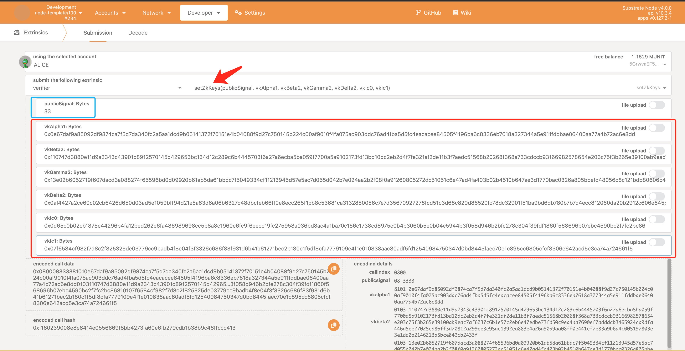
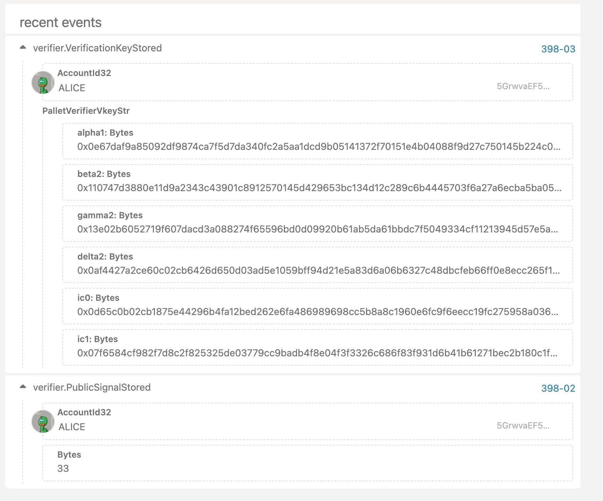
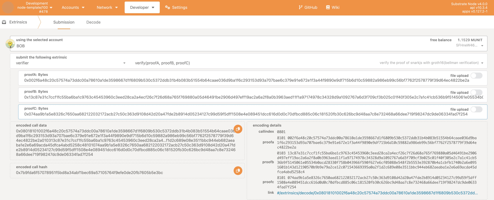
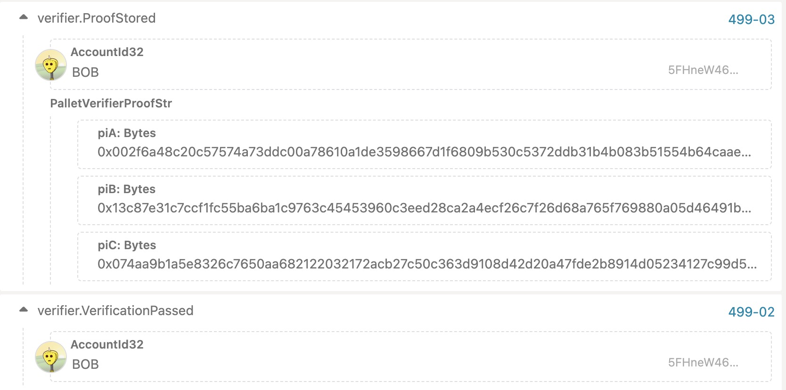

# Groth16: Theory to Practice
## Theory
The Groth16 algorithm is a non-interactive proof system used for zero-knowledge proofs, proposed by Jens Groth in 2016. Groth16 is one of the most widely used zero-knowledge proof systems and is built on previous work, primarily referencing protocols such as Pinocchio, GGPR13, and BCTV14.

Groth16 solves the problem of how to perform zero-knowledge proofs for complex computations. In zero-knowledge proof, the prover wishes to prove a statement about private inputs to the verifier, without revealing any information about the inputs themselves. The Groth16 proof system allows the prover to create a proof that they know a solution satisfying certain conditions, without revealing the actual solution to the verifier. As we previously introduced the basic concept of ZKSNARK, it is a specific algorithm implementation of ZKSNARK.

### Features:
- **Non-interactive**: Groth16 is a non-interactive proof system, meaning that only one communication is needed between the prover and the verifier.
- **Short proofs**: Groth16 proofs are short, with a size of only O(1), independent of the complexity of the proof.
- **Fast verification**: Groth16 proofs can be verified in polynomial time.
- **Trusted setup**: Groth16 requires a trusted setup phase for generating common parameters.
- **Applicable to any NP problem**: Groth16 proof system can construct zero-knowledge proofs for any NP problem.

## Protocol flow
Groth16 protocol is based on bilinear mapping and elliptic curve cryptography. The protocol consists of four phases: setup phase, proving phase, verification phase, and an optional preprocessing phase.

* setup phase, a set of public parameters is generated, including generators on an elliptic curve and some random numbers. A trusted third party is required to generate these parameters to prevent potential tampering. To avoid this issue, multiparty computation (MPC) can be used to generate the parameters, such as the Powers of Tau ceremony.

* proving phase, the prover uses the public parameters and private input to generate the proof. The proof will contain some commitments about the computation and points on the elliptic curve to prove that the prover knows a solution that satisfies certain conditions while maintaining the privacy of the input.

* verification phase, the verifier uses the public parameters and the proof provided by the prover to verify the truthfulness of the statement, without knowing the prover's private input.

* optional preprocessing phase, some computations related to the public parameters can be preprocessed to improve verification efficiency and speed up the process, especially for large computations and multiple proof verification scenarios.

The core of the Groth16 protocol is to use bilinear mapping to transform the problem from the elliptic curve group to a scalar problem. In this way, the prover can provide a zero-knowledge proof about the computation, and the verifier only needs to perform simple bilinear mapping calculations to verify the correctness of the proof.

## Principle of the Protocol
> This part will involve some theoretical mathematical calculations and formulas. We hope you can patiently read through them and also present to you in a relatively concise form. Of course, if you find it difficult to continue, you can directly skip to the practical part below. After completing all the practices, you can come back to better understand the theoretical part.

Let's review the construction steps of zk-SNARKs as introduced in the ZKSANRKS Interview. Here, we will summarize them in more detail. A zk-SNARKs protocol framework consists of the following steps:

1. Generate CRS (Common Reference String) that is independent of the circuit using secure multiparty computation.
2. Prover 𝓟 proves that they have witness 𝒘𝒊𝒕𝒏𝒆𝒔𝒔 that satisfies an arbitrary computation relation 𝑹.
3. Prover 𝓟 proves that they have witness 𝒘𝒊𝒕𝒏𝒆𝒔𝒔 that satisfies any polynomial-time algorithm.
4. Prover 𝓟 proves that they have witness 𝒘𝒊𝒕𝒏𝒆𝒔𝒔 that satisfies R1CS constraints.
5. The inner product of vector $\vec{s}$ and matrices $U$, $V$, $W$: $\vec{s} \cdot W = \vec{s} \cdot U * \vec{s} \cdot V$.
6. The vector $\vec{s}$ combines polynomials as follows: $\vec{s} \cdot W(x) - \vec{s} \cdot U(x) * \vec{s} \cdot V(x) = 0$.
7. The target polynomial $z(x)$ divides the QAP polynomial $z(x) | [\vec{s} \cdot W(x) - \vec{s} \cdot U(x) * \vec{s} \cdot V(x)]$ forming an NP problem.
8. Generate the CRS based on circuit polynomials 𝑾(𝒙), 𝑼(𝒙), 𝑽(𝒙).
9. Prover puts QAP polynomial, target polynomial, and quotient polynomial on elliptic curve discrete logarithm point.
10. Verifier 𝓥 reconstructs the division relation on elliptic curve discrete logarithm points, verifies the correctness of vector $\vec{s}$, but does not know vector $\vec{s}$.


### Initialization of CRS

* Random $\tau$ chosen during trusted setup as well as $\alpha$, $\beta$
* $n$ is number of gates.
* $u_i$, $v_i$ and $w_i$ are the QAP polynomials created from the R1CS circuit

$CRS: \{g_1^\alpha\, g_1^\beta, g_1^\delta, \{\{ g_1^{\tau^i}\}, \{g_1^{\alpha \tau^i}\}, \{g_1^{\beta \tau^i}\}\}_{i=0}^{n-1}, \{g_1^{\beta u_i(\tau) + \alpha v_i(\tau) + w_i(\tau)}\}_{i=0}^n\}, \{g_1^{\frac{\tau^it(x)}{\delta}}\}_{i=0}^{n-1},\\g_2^\beta, g_2^\delta, \{g_2^{\tau ^i}\}_{i=0}^{n-1}\}$
> $g_1$ is the generator of $G_1$, $g_2$ is the generator of $G_2$

The CRS (Common Reference String) is divided into two sets. The part needed for proving is denoted as `PK (Proving Key)`, and the part needed for verification is denoted as `VK (Verification Key)`.

### Prover
**Settings**:
* Regular proof is $\pi = (A, B, C)$. 
* $l+1$ is number of public inputs (+1 as first public input is "1" in R1CS)
* Vector of `public inputs` $\phi = (a_0, \dots, a_{l})$

**Extension**: 
Prover computes the regular proof and computes the following additionally 
* $S = g_1^{\sum_{i=0}^{l} a_i (\beta u_i(\tau) + \alpha v_i(\tau) + w_i(\tau))}$ 
> Construct linear combination relationships, and place the coefficients of the combined polynomial on the elliptic curve discrete logarithm points, forming a discrete logarithm problem that is difficult to solve.
* Derive random challenge $z = H(\phi, \pi, S)$
* Compute the three following elements.
    * $U = g_2^{\sum_{i=0}^l a_i ( \frac{u_i(\tau) - u_i(z)}{\tau - z})}$
    * $V = g_2^{\sum_{i=0}^l a_i ( \frac{v_i(\tau) - v_i(z)}{\tau - z})}$
    * $W = g_2^{\sum_{i=0}^l a_i ( \frac{w_i(\tau) - w_i(z)}{\tau - z})}$

* Proof is $(\pi, S, U , V , W)$

### Verifier
* Compute the following three elements $u_z, v_z, w_z \in \mathbb{F_r}$:
    * $u_z = \sum_{i=0}^l u_i(z)$
    * $v_z = \sum_{i=0}^l v_i(z)$
    * $w_z = \sum_{i=0}^l w_i(z)$
* Check **as usual**
    * $e(A,B) = e(g_1^\alpha, g_2^\beta)e(S,g2)e(C,g2^\delta)$
* Check public input construction
    * $e(Sg_1^{-\beta u_z -\alpha v_z -w_z},g_2) = e(g_1^{\beta \tau - \beta z}, U)e(g_1^{\alpha \tau - \alpha z},V)e(g_1^{\tau - z},W)$
    * These computations are done using the CRS

The CRS of Groth16 consists of very specific polynomials 𝑊(𝑥), 𝑈(𝑥), 𝑉(𝑥) that are equivalent to the R1CS constraints. Advantages: The prover 𝒫 can generate the proof using the polynomials 𝑊(𝑥), 𝑈(𝑥), 𝑉(𝑥) directly from the CRS, resulting in a fast verification. Disadvantages: The polynomials 𝑊(𝑥), 𝑈(𝑥), 𝑉(𝑥) in this CRS are derived from R1CS constraints and are fixed, which means that they can only express a unique circuit and their expressive power is relatively limited to other circuits.

## Practice1: Multilication
In the first example, we start with the simplest `multiplication` case "a * b = c". The public input is `c`, and the prover needs to prove to someone else that he know two values `a` and `b`, whose product is c, without revealing the values of a and b. You can go to directory `substrate-zk/snarkjs-bellman-adapter` to refer to its readme, complete `Pre-requirements` and `Use the adapter` section, and then come back here. I will explain to you what happens in the process and then show you how to verify the proof generated by snarkjs on our substrate-based chain with bellman.

### Generate a proof by snarkjs 
In the previous practice, you have run `./start.sh Multiplication` command. We will delve into the details of `start.sh` and explain in detail what it does.

1. start a new powers of tou ceremony(bls12_381)
```
snarkjs powersoftau new bls12_381 12 pot12_0000.ptau -v
```
The first parameter after new refers to the type of curve you wish to use. At the moment, we use `bls12-381` and in this way, we can adapt to Bellman very well which also using this curve.

2. contribute to the `powers of tau ceremony` and prepare circuit
```shell
# contribute to the ceremony
snarkjs powersoftau contribute pot12_0000.ptau pot12_0001.ptau --name="First contribution" -v
snarkjs powersoftau contribute pot12_0001.ptau pot12_0002.ptau --name="Second contribution" -v -e="some random text"
snarkjs powersoftau export challenge pot12_0002.ptau challenge_0003
snarkjs powersoftau challenge contribute bls12_381 challenge_0003 response_0003 -e="some random text"
snarkjs powersoftau import response pot12_0002.ptau response_0003 pot12_0003.ptau -n="Third contribution name"

# verify the ptau
snarkjs powersoftau verify pot12_0003.ptau
snarkjs powersoftau beacon pot12_0003.ptau pot12_beacon.ptau 0102030405060708090a0b0c0d0e0f101112131415161718191a1b1c1d1e1f 10 -n="Final Beacon"

# prepare the phase 2 (ceremony with circuit) 
snarkjs powersoftau prepare phase2 pot12_beacon.ptau pot12_final.ptau -v
snarkjs powersoftau verify pot12_final.ptau
```

3. compile the cicuit and run circuit ceremony

The circom command takes one input (the circuit to compile, in our case circuit.circom) and three options:
- `r1cs`: generates circuit.r1cs (the r1cs constraint system of the circuit in binary format).
- `wasm`: generates circuit.wasm (the wasm code to generate the witness – more on that later).
- `sym`: generates circuit.sym (a symbols file required for debugging and printing the constraint system in an annotated mode).
```shell
  circom circuit.circom --r1cs --wasm --sym -p bls12381
```

print some information about the circuit and create the `witness` (values of all the wires) for our inputs.
```shell
  snarkjs info -r circuit.r1cs
  snarkjs r1cs print circuit.r1cs circuit.sym

  #export the r1cs to json
  snarkjs r1cs export json circuit.r1cs circuit.r1cs.json

  cd circuit_js
  node generate_witness.js circuit.wasm ../input.json ../witness.wtns
  cd ..
```

`Groth16` requires `a trusted ceremony for each specific circuit`. So we need the follow command to setup a ceremony

```shell
  #setup the phase 2 circuit ceremony
  snarkjs groth16 setup circuit.r1cs pot12_final.ptau circuit_0000.zkey

  # first contribution
  snarkjs zkey contribute circuit_0000.zkey circuit_0001.zkey --name="1st Contributor Name" -v

  # second contribution
  snarkjs zkey contribute circuit_0001.zkey circuit_0002.zkey --name="Second contribution Name" -v -e="Another random entropy"

  # Third contribution
  snarkjs zkey export bellman circuit_0002.zkey  challenge_phase2_0003
  snarkjs zkey bellman contribute bls12_381 challenge_phase2_0003 response_phase2_0003 -e="some random text"
  snarkjs zkey import bellman circuit_0002.zkey response_phase2_0003 circuit_0003.zkey -n="Third contribution name"

  # verify the latest key
  snarkjs zkey verify circuit.r1cs pot12_final.ptau circuit_0003.zkey
  snarkjs zkey beacon circuit_0003.zkey circuit_final.zkey 0102030405060708090a0b0c0d0e0f101112131415161718191a1b1c1d1e1f 10 -n="Final Beacon phase2"
```

Before we go ahead and export the verification key as a json, we perform a final check and verify the final protocol transcript (zkey). Last, We can export the verification key from `circuit_final.zkey` into `verification_key.json`.

```shell
  snarkjs zkey verify circuit.r1cs pot12_final.ptau circuit_final.zkey
  snarkjs zkey export verificationkey circuit_final.zkey verification_key.json
```

We can create the proof and this command will generate the files:
- proof.json: contains the actual proof
- public.json contains the values of the public inputs and output.

```shell
snarkjs groth16 prove circuit_final.zkey witness.wtns proof.json public.json
```
> Do you remember what we wanted to prove? We wanted to prove that we know the values of `a` and `b`, but here we didn't directly prove that we know a and b by presenting their values `1` and `33` as proof. Instead, we used ZKP to convert them into a special representation, which is the `proof.json` in our case. Anyone who knows the value of proof.json cannot deduce what the values of a and b are. However, for a verifier, it is very fast to verify that we do know the values of a and b by the proof.json. This is the magic of ZKP!

In the last, we use the snarkjs to verify the proof
```shell
snarkjs groth16 verify verification_key.json public.json proof.json
```

Okay, so far, we have learned about the process of generating a proof using snarkjs and verifying the proof using bellman. The next step is to use bellman to verify the proof generated by snarkjs on the substrate-based chain, which is our ultimate goal.

### Verify the proof by bellman on substrate
1. start the substrate chain  
go to the dir `~/..../substrate-zk`
```
./target/release/node-template --dev --tmp
```

2. get the proof and verification key   
If you have run all the practice before, go to dir `snarkjs-bellman-adapter/circuit/Multiplication`, you can find two file `proof_hex.json` and `vkey_hex.json` which we will use in the next step.

For example, My proof_hex.json is:
```json
{
  "pi_a": "0x002f6a48c20c57574a73ddc00a78610a1de3598667d1f6809b530c5372ddb31b4b083b51554b64caae036d9ba1f6c293153d93a707bae6c379e91e672e1f3a44f9890e9df715b6d10c59882a986eb99c56bf7762f2578779f39d64ec4822be2a",
  "pi_b": "0x13c87e31c7ccf1fc55ba6ba1c9763c45453960c3eed28ca2a4ecf26c7f26d68a765f769880a05d46491be2906d497eff19ac2a6a2f8a0b3963aed11f1a97174978c34328d9a1092767a6d3f709cf3b025c01f40f305e2c7a1c41cb536b9f5145061e05534b0acd28330f758b043966f590f627e6cf05088e548f2b5553e392870b4a1cbfb1740b2a6e0951601b143d12190570b9b9e79a2ce12c071543669395a0a2f1d2c689e08e3511bbc944eb682aeaba1e2e6a69acda45dfca4abd5258c4",
  "pi_c": "0x074aa9b1a5e8326c7650aa682122032172acb27c50c363d9108d42d20a47fde2b8914d05234127c99d59f5dff1508e4e089451dcc616d0d0c70dfbcd885c06c181520fb30c626bc9d48aa7c8e732468a66dee719f98247dc9de06334fad7f254"
}
```
vkey_hex.json is:
```json
{
  "alpha_1": "0x0e67daf9a85092df9874ca7f5d7da340fc2a5aa1dcd9b05141372f70151e4b04088f9d27c750145b224c00af9010f4fa075ac903ddc76ad4fba5d5fc4eacacee84505f4196ba6c8336eb7618a327344a5e911fddbae06400aa77a4b72ac6e8dd",
  "beta_2": "0x110747d3880e11d9a2343c43901c8912570145d429653bc134d12c289c6b4445703f6a27a6ecba5ba059f7700a5a9102173fd13bd10dc2eb2d4f7fe321af2de11b3f7aedc51568b20268f368a733cdccb93166982578654e203c75f3b265e39100ab9eac7af6237c6b1e57c2eb6e47edbe73fd50c9ed4ba7690ef7adddcb3465924ca9dfa446d5ee27025eb86ff3d70812a299ee8e95ae1392ea883e4a26a90b9aa08ff0e441ef7e83a9b6a4c005197803e3e1dd0b2146213a5bce849cb2433f",
  "gamma_2": "0x13e02b6052719f607dacd3a088274f65596bd0d09920b61ab5da61bbdc7f5049334cf11213945d57e5ac7d055d042b7e024aa2b2f08f0a91260805272dc51051c6e47ad4fa403b02b4510b647ae3d1770bac0326a805bbefd48056c8c121bdb80606c4a02ea734cc32acd2b02bc28b99cb3e287e85a763af267492ab572e99ab3f370d275cec1da1aaa9075ff05f79be0ce5d527727d6e118cc9cdc6da2e351aadfd9baa8cbdd3a76d429a695160d12c923ac9cc3baca289e193548608b82801",
  "delta_2": "0x0af4427a2ce60c02cb6426d650d03ad5e1059bff94d21e5a83d6a06b6327c48dbcfeb66ff0e8ecc265f1bb8c53681ca3132850056c7e7d35670927278fcd51c3d68c829d86520fc78dc32901f51ba9bd6db780b7b7d4ecc812060da20b2912c606e645b538ca41ce11acb642d49192f4105fd16aa1710a18505be03c558a9a1c7c1a5ee73195f73afed91e5743600387006ee1188191e9cab2061ea2dd8216ec23da8b64708aa6e4ec98ec8cd595c38105ac0a1b2347ec4c5c42d3ed78e6bb06",
  "ic0": "0x0d65c0b02cb1875e44296b4fa12bed262e6fa486989698cc5b8a8c1960e6fc9f6eecc19fc275958a036bd8ac4a1ba70c156c1738cd8975e0b4b3060b5e0b04e5944b3f058d946b2bfe278c304f39fdf1860f568696b07ebc4590bc2f7fc2bc86",
  "ic1": "0x07f6584cf982f7d8c2f825325de03779cc9badb4f8e04f3f3326c686f83f931d6b41b61271bec2b180c1f5df8cfa7779109e4f1e010838aac80adf5fd12540984750347d0bd8445faec70e1c895cc6805cfcf8306e642acd5e3ca74a724661f5"
}

```
> Of course, the generated proof is different each time. You can follow the steps below based on your actual file content.

3. set zk parameter on substrate-based chain    
We can open the PolkadotJS browser, and then navigate to the `verifier` pallet, and select the method `setZkKeys`, like this:


We assume Alice is the verifier, who is the creator of the multiplication zk-SNARK circuit, where the public input is 33. Next are the parameters of the verification key, which are the contents of the vkey_hex.json file we mentioned earlier.

If you pass the parameter correctly, it will be store in the chain, like this event:


4. prover set proof and check the result

Now, Bob sees the ZKP problem set by Alice and wants to prove that he knows the result of a*b. Bob uploads his proof, which is the content of proof_hex.json. We select the `verify` method as Bob.

Once we execute this method, the bellman on the chain will verify the correctness of this proof of snarkjs.

Great! If you see the above fig, which means your proof passed the verification!

## Practice2: Merkle Tree
After running the previous example, we now have a basic understanding of the zk-SNARK execution process. 

In this example, we will introduce a more advanced example: `verify the correctness of a Merkle tree using zk-SNARKs`. This is the simplest example of implementing `rollup`. The specific circuit can be found in `substrate-zk/snarkjs-bellman-adaper/circuit/MerkleTree`, which provides a detailed introduction to the circuit. If you want to run the example, the method is the same as the first Multiplication example.


- First, generate `input.json` for the Merkle tree
  go into the dir `snarkjs-bellman-adapter/circuit/MerkleTree` and run with: 
  ```shell
  npm install && node generate_merkle_root_input.js
  ```

- Generate proof and verification key with `circuit.circom` and `inputs.json` in the dir `circuit` of this project by `start.sh`. And then generate the the uncompressed hex format proof and verification key.
```
cd ../../ && ./start.sh MerkleTree
cd prove && npm install
cd src && node adapter.js MerkleTree
cd ../../verify/src/adapter
CIRCUIT_DIR_NAME=MerkleTree PUBLIC_INPUT=0 cargo test snark_proof_bellman_verify -- --nocapture
``````

In this case, out public input is "0". If you see the below output, which means the verification with bellman passed.

```
running 1 test
THE CIRCUIT YOU ARE TESTING IS : MerkleTree
PUBLIC INPUT is : 0
>>>>start encode the uncompressed data to Affine<<<<<
>>>>end verification<<<<<<<
test adapter::snark_proof_bellman_verify ... ok

test result: ok. 1 passed; 0 failed; 0 ignored; 0 measured; 0 filtered out; finished in 0.07s
```

If you want to learn more about circuit implementation, you can refer to the documentation in `snarkjs-bellman-adapter/circuit/MerkleTree/README.md`, which provides detailed explanations.

If you want to verify this proof on the chain, the process is the same as the Multiplication circuit above.